> **List Assignment 2:**
>
> > - [How To Signup in Netlify and auto-Deploy with GitHub](#how-to-signup-in-netlify-and-connect-it-with-github)
> > - [How to connect Custom Domain and DNS](#how-to-connect-custom-domain-and-dns)
> > - [Luv2read](https://www.luv2read.site/) Domain
> > - [Luv2Read Netlify](https://module-2-desyasarbini.netlify.app/) Deploy (not domain)

# Desya Saskia Sarbini's Profile

This is my 1st assignment for "My Profile".

> > ## Hello there,
> >
> > 
> > I'm **Desya Saskia Sarbini**, you can call me **_eci_**. I'm an Automation Engineer in Aviation field with 6 years experience.
> >
> > I'm skilled in operating, maintenace, and troubleshooting an automation equipment. however, I can also operating communication, navigation, and surveillance equipment to make sure it always ready tu use by users.
> >
> > ### Contact
> >
> > | Social Media | Links                                                           |
> > | ------------ | --------------------------------------------------------------- |
> > | Linkedin     | [Linkedin](https://www.linkedin.com/in/desya-sarbini).          |
> > | GitHub       | [GitHub](https://github.com/desyasarbini).                      |
> > | Instagram    | [Instagram](https://www.instagram.com/deesyaaaaasarbiniiiii_/). |
> >
> > > #### Skills
> > >
> > > - ELSA AMSC (Operating, Maintenace, Troubleshoot)
> > > - Handmade Embroidery, you can also see my handcraft in [here](https://www.instagram.com/aerigom_/).
> > > - Ms Office, Canva, Drawing.
> > >
> > > ##### Hobbies
> > >
> > > 1. I love to watch cartoon, anime, movies, documentary and anykind of movie except horror movie. I'll skip that one :D
> > > 2. Reading also the thing that I enjoy mostly.
> > > 3. I have sweet tooth, that's why it hard for me to resist dessert

### How to signup in Netlify and connect it with GitHub

> 1.  Before we start, we need to settings our repository in public mode :
>
> - go to repository you want to deploy > - klik settings and scroll it down until <strong>danger zone</strong>.
>   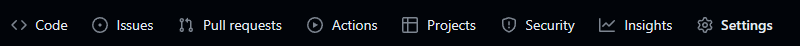.
>   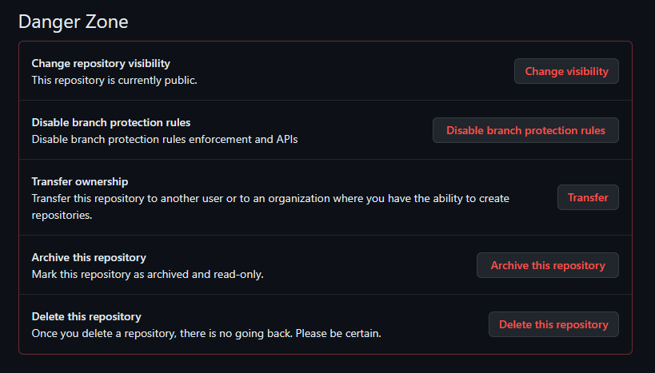.

> - Once you click <strong>change visibility</strong> change it to public.
> - Check it beside your repository name if it's public then you can start to connect it with netlify
>   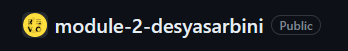.

> 1.  Open [netlify](https://app.netlify.com/) websites
> 2.  If you have a GitHub account, then you can use it to sign up and login.
>     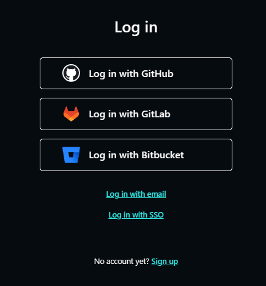

> 3.  Click add new items, and choose import an existing project.
>     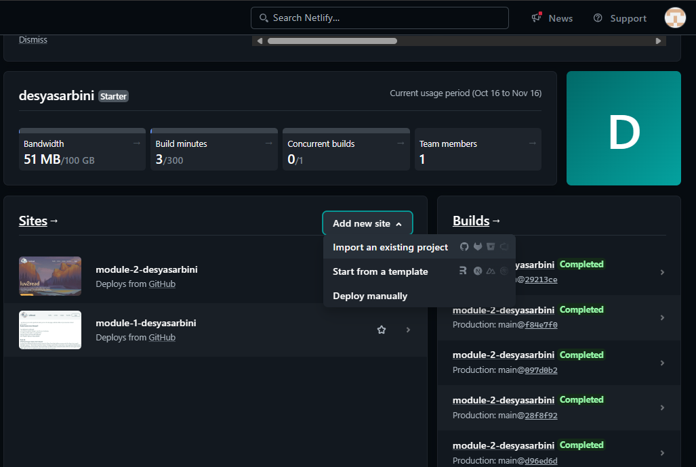

> 4.  Choose GitHub as your provider.
>     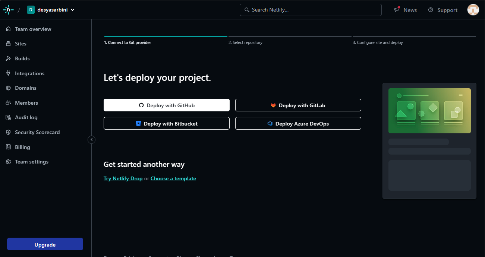

> 5.  Choose the repository you're working on. so netlify can automaticly updated your project when you push the code to your repository.
>
> - usually it will ask for access to your repository
> - fill the form access correctly
> - and you choose the repository again that you already set to public.
>   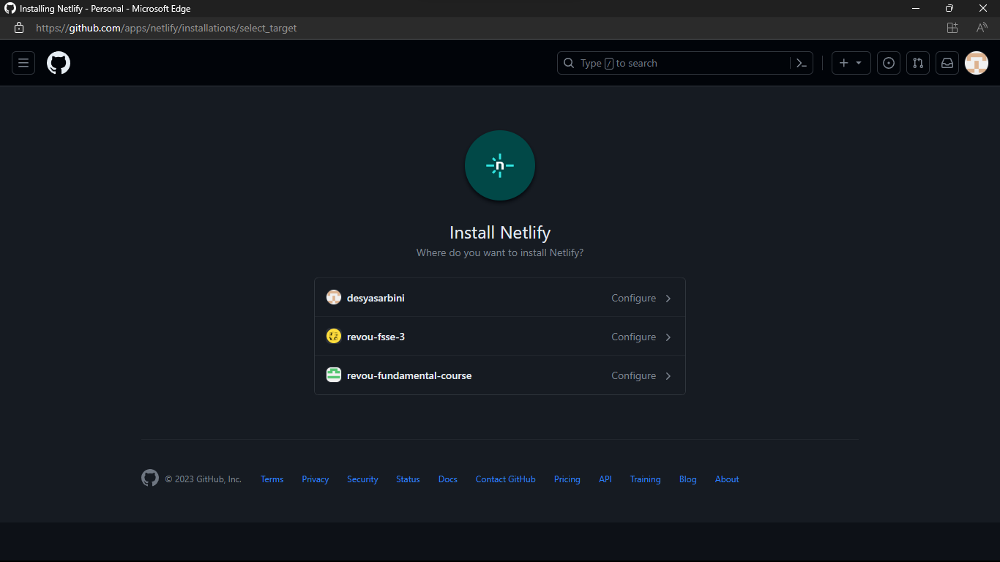.
>   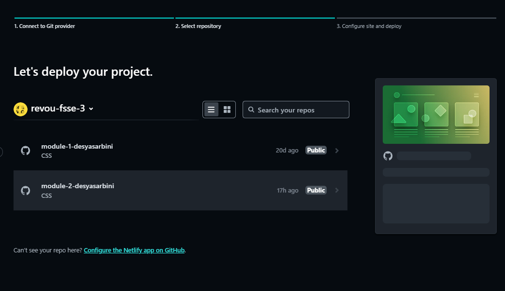.

> 6.  Choose branch you want to deploy, scroll it down, and click Deploy
> 7.  when the deploy finished, it will look like this
>     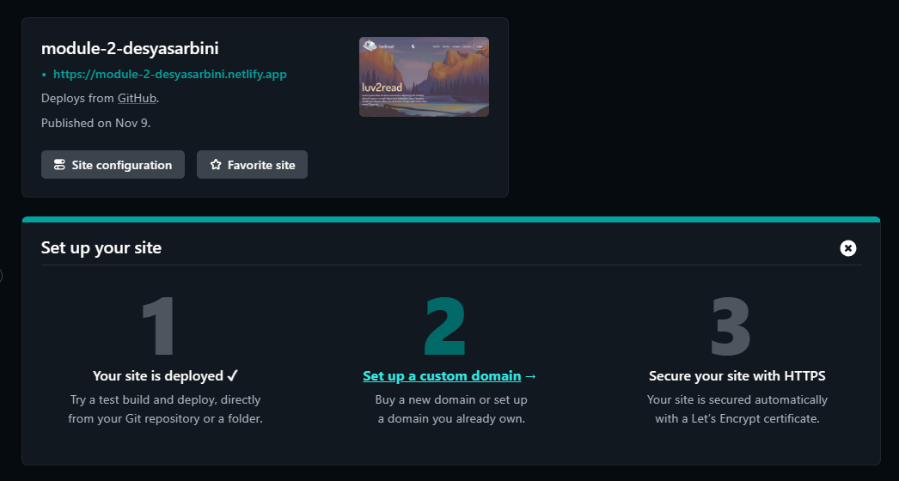.

> 8.  Now, you only need to change the site name, if you want.
>
> - click site configure
> - change site name
> - and type the name site you one to use.
>   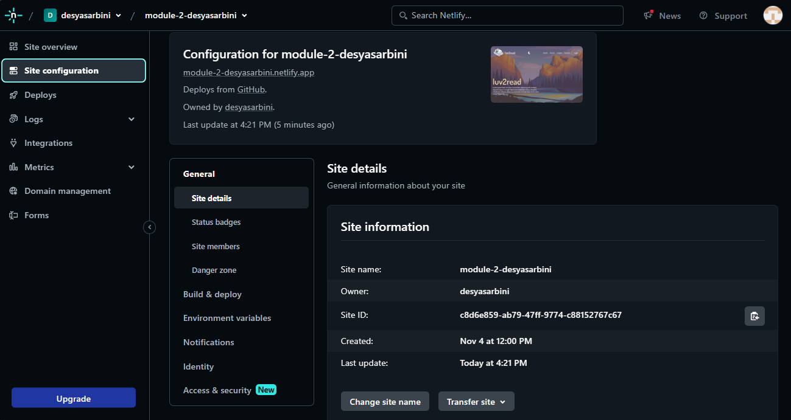
>
> 9. finish

### How to connect Custom Domain and DNS

> 1. Purchased domain. I use [Niagahoster](https://www.niagahoster.co.id/).
> 2. Signup or Login first
> 3. Click menu-bar on the top-right, and choose domains.
> 4. You will be delivered to <strong>New Domain</strong> page. you can search domain name you like and purchased it.
> 5. Purchased steps are similar with how you purchased things on online market.
> 6. Once you got your domain. go to [vercel](https://vercel.com/).
>    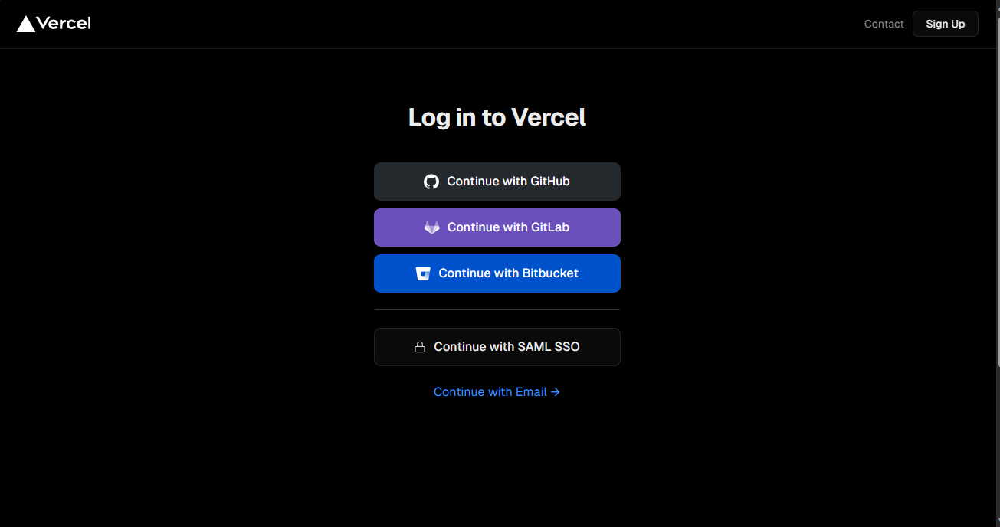.
> 7. login with your GitHub account.
> 8. Go to domain settings and input domain name
>    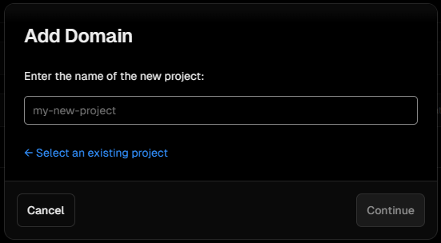
> 9. after that, scroll it down until you find DNS record, copy the DNS record and paste it on niagahoster DNS Record Manage.
>    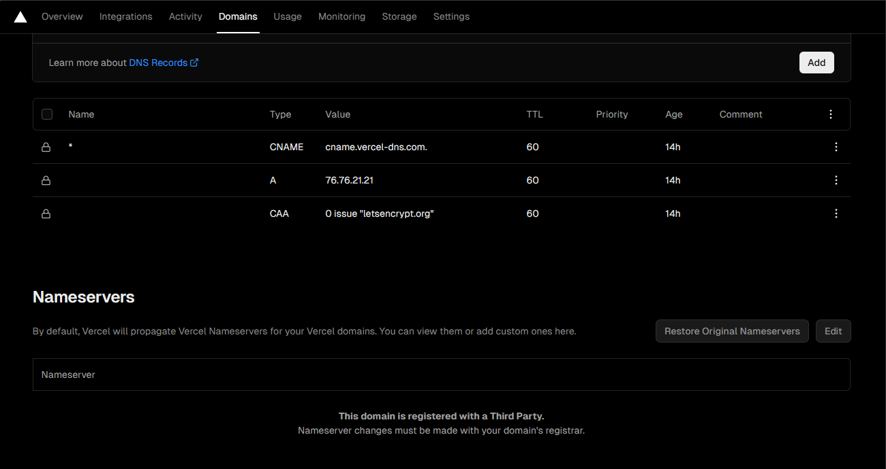.
>    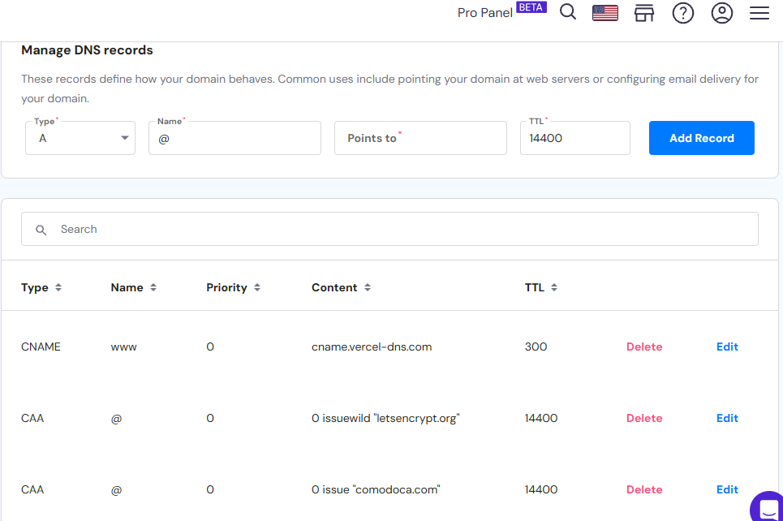.
> 10. click the edit and change the DNS setting following vercel
>     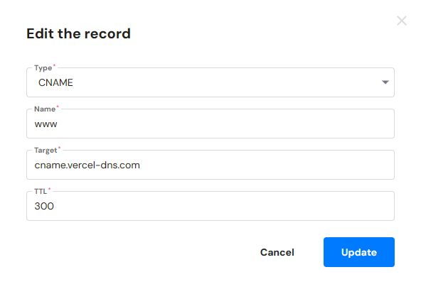.
> 11. save it. now we just need to wait maximum 1x24 hours, for the domain to be active.
> 12. thank you.
