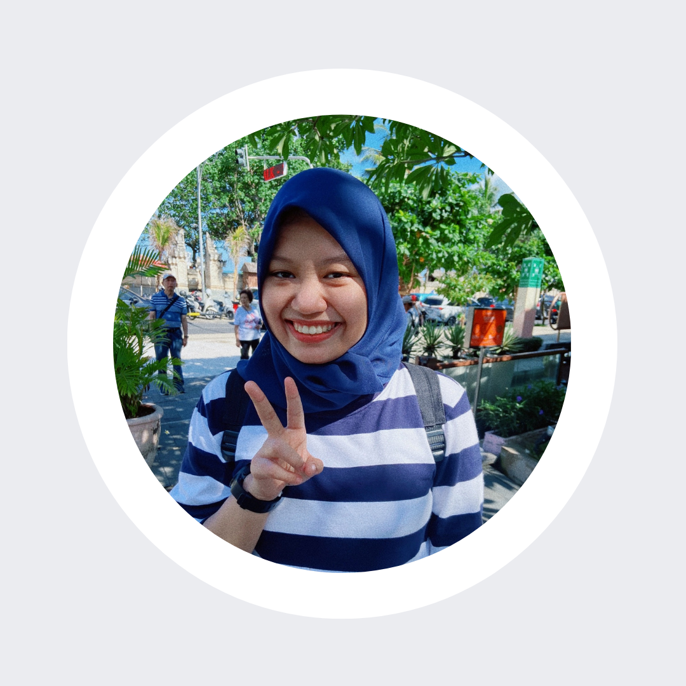

# Desya Saskia Sarbini's Profile
> This is my 1st assignment for "My Profile"

>> ## Hello there,

>>I'm **Desya Saskia Sarbini**, you can call me ***eci***. I'm an Automation Engineer in Aviation field with 6  years experience. 
>>
>>I'm skilled in operating, maintenace, and troubleshooting an automation equipment. however, I can also operating communication, navigation, and surveillance equipment to make sure it always ready tu use by users.
>>
>> ### Contact 
>>| Social Media  | Links                                                               |
>>| ------------- |---------------------------------------------------------------------|
>>| Linkedin      | [Linkedin](https://www.linkedin.com/in/desya-sarbini).              |
>>| GitHub        | [GitHub](https://github.com/desyasarbini).                          |
>>| Instagram     | [Instagram](https://www.instagram.com/deesyaaaaasarbiniiiii_/).     |
>>
>>> #### Skills
>>> - ELSA AMSC (Operating, Maintenace, Troubleshoot)
>>> - Handmade Embroidery, you can also see my handcraft in [here](https://www.instagram.com/aerigom_/).  
>>> - Ms Office, Canva, Drawing.
>>>
>>> ##### Hobbies
>>> 1. I love to watch cartoon, anime, movies, documentary and  anykind of movie except horror movie. I'll skip that one :D
>>> 2. Reading also the thing that I enjoy mostly.
>>> 3. I have sweet tooth, that's why it hard for me to resist dessert 
>>>
check my assignment here https://module-1-desyasarbini.netlify.app/

